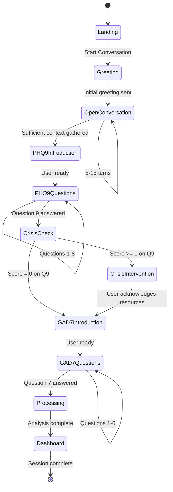

# Design Document: AI Virtual Clinical Psychologist

## Overview

The AI Virtual Clinical Psychologist is a web-based mental health screening platform that provides accessible, conversational early detection of depression and anxiety through AI-powered natural language interaction. The system conducts empathetic conversations with users, administers validated psychological assessments (PHQ-9 and GAD-7), analyzes emotional patterns in language, calculates risk scores, and generates comprehensive visual reports with personalized recommendations.

### Core Capabilities

- Natural conversational interface mimicking ChatGPT-style interaction
- Multi-modal input support (text and voice)
- Validated psychological test administration (PHQ-9, GAD-7)
- Real-time language analysis and emotion detection
- Risk scoring based on clinical standards
- Visual report generation with charts and insights
- Psychologist matching for moderate-to-severe cases
- Crisis detection and immediate resource provision
- Multi-language support (English and Hindi)

### Design Principles

1. **User-Centered Safety**: Prioritize user emotional safety and crisis response above all features
2. **Clinical Validity**: Maintain fidelity to validated instruments (PHQ-9, GAD-7)
3. **Conversational Naturalness**: Create comfortable, empathetic interactions
4. **Privacy-First**: Encrypt and anonymize all sensitive data
5. **Accessibility**: Ensure WCAG 2.1 AA compliance
6. **Transparency**: Clearly communicate AI limitations and screening vs. diagnosis distinction
7. **Modern UI/UX**: Use modern React components from reactbits.dev with animations, scroll effects, text animations, and micro-interactions throughout the application
7. **Modern UI/UX**: Use modern React components from reactbits.dev with animations, scroll effects, and micro-interactions throughout the application

## Architecture

### System Architecture Overview

The system follows a three-tier architecture with clear separation between presentation, business logic, and data layers:

```
┌─────────────────────────────────────────────────────────────┐
│                     Presentation Layer                       │
│  ┌──────────────┐  ┌──────────────┐  ┌──────────────┐      │
│  │ Landing Page │  │ Chat Interface│  │  Dashboard   │      │
│  └──────────────┘  └──────────────┘  └──────────────┘      │
└─────────────────────────────────────────────────────────────┘
                            │
                            ▼
┌─────────────────────────────────────────────────────────────┐
│                    Application Layer                         │
│  ┌──────────────┐  ┌──────────────┐  ┌──────────────┐      │
│  │   Virtual    │  │     Test     │  │    Report    │      │
│  │ Psychologist │  │Administrator │  │  Generator   │      │
│  └──────────────┘  └──────────────┘  └──────────────┘      │
│  ┌──────────────┐  ┌──────────────┐  ┌──────────────┐      │
│  │   Language   │  │   Emotion    │  │     Risk     │      │
│  │   Analyzer   │  │   Detector   │  │    Scorer    │      │
│  └──────────────┘  └──────────────┘  └──────────────┘      │
│  ┌──────────────┐  ┌──────────────┐                         │
│  │    Speech    │  │ Psychologist │                         │
│  │  Processor   │  │  Connector   │                         │
│  └──────────────┘  └──────────────┘                         │
└─────────────────────────────────────────────────────────────┘
                            │
                            ▼
┌─────────────────────────────────────────────────────────────┐
│                      Data Layer                              │
│  ┌──────────────┐  ┌──────────────┐  ┌──────────────┐      │
│  │   MongoDB    │  │    Redis     │  │   File       │      │
│  │   Database   │  │    Cache     │  │   Storage    │      │
│  └──────────────┘  └──────────────┘  └──────────────┘      │
└─────────────────────────────────────────────────────────────┘
                            │
                            ▼
┌─────────────────────────────────────────────────────────────┐
│                   External Services                          │
│  ┌──────────────┐  ┌──────────────┐  ┌──────────────┐      │
│  │  OpenAI GPT  │  │ HuggingFace  │  │   Whisper    │      │
│  │     API      │  │   Models     │  │     API      │      │
│  └──────────────┘  └──────────────┘  └──────────────┘      │
└─────────────────────────────────────────────────────────────┘
```

### Architecture Patterns

- **MVC Pattern**: Separation of concerns between UI, business logic, and data
- **Service-Oriented**: Core capabilities exposed as independent services
- **Event-Driven**: Asynchronous processing for AI analysis and report generation
- **API Gateway**: Centralized routing and authentication for external services
- **Circuit Breaker**: Fallback mechanisms for external API failures


## Components and Interfaces

### Frontend Components

#### 1. Landing Page Component

**Responsibility**: Entry point for users, marketing content, and session initiation

**Key Elements**:
- Hero section with title and subtitle
- "Start Conversation" CTA button
- "Learn More" button with smooth scroll
- Feature showcase sections using GridScan component from shadcn/react-bits
- Privacy disclaimer
- Dark theme with gradient accents

**Component Library**:
- Uses shadcn/ui with GridScan component from @react-bits/GridScan-JS-CSS
- GridScan provides animated grid layout for feature sections
- Installed via: `npx shadcn@latest add @react-bits/GridScan-JS-CSS`

**State Management**:
#### 2. Chat Interface Component

**Responsibility**: Real-time conversational interaction with the Virtual Psychologist

**Key Elements**:
- Message list container with auto-scroll
- Message bubbles (AI left, user right) with smooth animations
- Text input field with send button
- Microphone button for voice input with modern interactions
- Typing indicator animation
- Session state indicator
- Modern UI animations for message appearance
- Scroll animations for message list

**Component Library (reactbits.dev)**:
- Text animations for message content
- Smooth scroll components for message list
- Modern input components with animations
- Button components with micro-interactionswith auto-scroll
- Message bubbles (AI left, user right)
- Text input field with send button
- Microphone button for voice input
- Typing indicator animation
- Session state indicator

**State Management**:
```typescript
interface ChatState {
  messages: Message[];
  isTyping: boolean;
  isRecording: boolean;
  sessionId: string;
  currentPhase: 'conversation' | 'phq9' | 'gad7' | 'processing';
}

interface Message {
  id: string;
  role: 'user' | 'assistant';
  content: string;
#### 3. Dashboard Component

**Responsibility**: Display comprehensive mental health screening results

**Key Elements**:
- Risk score cards (PHQ-9, GAD-7) with animated reveals
- Emotion analysis chart (bar/radar chart) with smooth transitions
- Key observations list with staggered text animations
- AI suggestions panel with modern card design
- Psychologist connection section (conditional) with grid layout
- Download/export buttons with modern interactions
- Disclaimer text
- Scroll-triggered animations for section reveals

**Component Library (reactbits.dev)**:
- Card components with animations
- Grid layouts for psychologist profiles
- Text animations for observations and suggestions
- Chart components with smooth transitions
- Scroll-triggered animations
- Modern button components buttons with modern interactions
- Disclaimer text
- Scroll animations for section reveals

**Component Library (reactbits.dev)**:
- Card components with animations
- Grid layouts for psychologist profiles
- Text animations for observations and suggestions
- Chart components with smooth transitions
- Scroll-triggered animations

#### 3. Dashboard Component

**Responsibility**: Display comprehensive mental health screening results

**Key Elements**:
- Risk score cards (PHQ-9, GAD-7)
- Emotion analysis chart (bar/radar chart)
- Key observations list
#### 4. Processing Screen Component

**Responsibility**: Provide visual feedback during AI analysis

**Key Elements**:
- Animated progress indicators with modern design
- Step-by-step status messages with text animations
- Loading animations and spinners
- Smooth transitions between steps
- Modern UI effects and micro-interactions

**Component Library (reactbits.dev)**:
- Progress indicator components
- Text animations for status messages
- Loading spinner components
- Transition effects
  report: ScreeningReport;
#### 4. Processing Screen Component

**Responsibility**: Provide visual feedback during AI analysis

**Key Elements**:
- Animated progress indicators with modern design
- Step-by-step status messages with text animations
- Loading animations and spinners
- Smooth transitions between steps
- Modern UI effects and micro-interactions

**Component Library (reactbits.dev)**:
- Progress indicator components
- Text animations for status messages
- Loading spinner components
- Transition effects: 'minimal' | 'mild' | 'moderate' | 'severe';
  emotions: EmotionAnalysis[];
  keyObservations: string[];
  suggestions: string[];
  timestamp: Date;
}
```

**API Interactions**:
- `GET /api/report/{sessionId}` - Retrieve screening report
- `GET /api/psychologists?risk={level}` - Get matched psychologists
- `POST /api/report/{sessionId}/export` - Generate PDF/HTML export

#### 4. Processing Screen Component

**Responsibility**: Provide visual feedback during AI analysis

**Key Elements**:
- Animated progress indicators
- Step-by-step status messages
- Loading animations
- Smooth transitions

**State Management**:
```typescript
interface ProcessingState {
  currentStep: number;
  steps: ProcessingStep[];
  progress: number;
}

interface ProcessingStep {
  id: string;
  label: string;
  status: 'pending' | 'active' | 'complete';
}
```


### Backend Services

#### 1. Virtual Psychologist Service

**Responsibility**: Generate contextually appropriate conversational responses

**Core Functions**:
- `generateGreeting(language: string): Promise<string>` - Create warm introduction
- `generateResponse(context: ConversationContext): Promise<string>` - Generate empathetic responses
- `generateQuestion(phase: string, context: ConversationContext): Promise<string>` - Create psychological questions
- `shouldTransitionToTests(conversationTurns: number, context: ConversationContext): boolean` - Determine test readiness

**Integration**:
- OpenAI GPT-4 API for natural language generation
- Conversation context management (last 10 turns)
- Prompt engineering for psychological appropriateness

**Prompt Template**:
```
You are a compassionate virtual clinical psychologist conducting an initial mental health screening.
Your role is to:
- Ask open-ended questions about mood, sleep, social engagement, and cognitive patterns
- Respond empathetically to user input
- Avoid clinical jargon
- Never trigger severe emotional distress
- Maintain a warm, supportive tone

Current conversation context: {context}
User's last message: {userMessage}

Generate an appropriate response:
```

#### 2. Test Administrator Service

**Responsibility**: Deliver PHQ-9 and GAD-7 tests conversationally

**Core Functions**:
- `initiatePHQ9(sessionId: string): Promise<void>` - Start PHQ-9 test
- `initiateGAD7(sessionId: string): Promise<void>` - Start GAD-7 test
- `presentQuestion(testType: string, questionNumber: number): Promise<string>` - Get next question
- `recordResponse(sessionId: string, questionId: string, score: number): Promise<void>` - Store answer
- `calculateScore(sessionId: string, testType: string): Promise<number>` - Sum responses

**Data Structures**:
```typescript
const PHQ9_QUESTIONS = [
  { id: 'phq9_1', text: 'Little interest or pleasure in doing things', order: 1 },
  { id: 'phq9_2', text: 'Feeling down, depressed, or hopeless', order: 2 },
  { id: 'phq9_3', text: 'Trouble falling or staying asleep, or sleeping too much', order: 3 },
  { id: 'phq9_4', text: 'Feeling tired or having little energy', order: 4 },
  { id: 'phq9_5', text: 'Poor appetite or overeating', order: 5 },
  { id: 'phq9_6', text: 'Feeling bad about yourself or that you are a failure', order: 6 },
  { id: 'phq9_7', text: 'Trouble concentrating on things', order: 7 },
  { id: 'phq9_8', text: 'Moving or speaking slowly, or being fidgety or restless', order: 8 },
  { id: 'phq9_9', text: 'Thoughts that you would be better off dead or of hurting yourself', order: 9 }
];

const GAD7_QUESTIONS = [
  { id: 'gad7_1', text: 'Feeling nervous, anxious, or on edge', order: 1 },
  { id: 'gad7_2', text: 'Not being able to stop or control worrying', order: 2 },
  { id: 'gad7_3', text: 'Worrying too much about different things', order: 3 },
  { id: 'gad7_4', text: 'Trouble relaxing', order: 4 },
  { id: 'gad7_5', text: 'Being so restless that it is hard to sit still', order: 5 },
  { id: 'gad7_6', text: 'Becoming easily annoyed or irritable', order: 6 },
  { id: 'gad7_7', text: 'Feeling afraid as if something awful might happen', order: 7 }
];

const RESPONSE_OPTIONS = [
  { value: 0, label: 'Not at all' },
  { value: 1, label: 'Several days' },
  { value: 2, label: 'More than half the days' },
  { value: 3, label: 'Nearly every day' }
];
```

stilroberta-base`)
- Fine-tuned models for mental health context

geIntensity: number;
  timeline: { timestamp: Date; emotion: EmotionCategory }[];
}
```

**Integration**:
- HuggingFace emotion classification models (e.g., `j-hartmann/emotion-english-dion: EmotionCategory): number` - Intensity score
- `trackEmotionalPattern(sessionId: string): Promise<EmotionPattern>` - Session-wide trends

**Data Structures**:
```typescript
type EmotionCategory = 'sadness' | 'fear' | 'anger' | 'joy' | 'surprise' | 'neutral';

interface EmotionAnalysis {
  emotion: EmotionCategory;
  intensity: number; // 0-100
  valence: 'positive' | 'negative' | 'mixed';
  confidence: number;
}

interface EmotionPattern {
  dominantEmotion: EmotionCategory;
  emotionShifts: number;
  averailter'
  | 'personalization';
```

**Integration**:
- Google NLP API or IBM Watson for sentiment analysis
- Custom pattern matching for psychological indicators
- Language-specific models for English and Hindi

#### 4. Emotion Detector Service

**Responsibility**: Classify emotions and measure intensity

**Core Functions**:
- `detectEmotions(text: string): Promise<EmotionAnalysis[]>` - Identify emotions
- `classifyEmotion(text: string): EmotionCategory` - Primary emotion
- `measureIntensity(text: string, emoti- Negative/positive ratio

**Analysis Output**:
```typescript
interface LanguageAnalysis {
  indicators: {
    negativeSelfTalk: boolean;
    hopelessness: boolean;
    cognitiveDistortions: CognitiveDistortion[];
    temporalFocus: 'past' | 'present' | 'future';
  };
  metrics: {
    linguisticComplexity: number;
    sentimentRatio: number;
    emotionalIntensity: number;
  };
  confidence: number;
}

type CognitiveDistortion = 
  | 'all_or_nothing'
  | 'catastrophizing'
  | 'overgeneralization'
  | 'mental_flfTalk(text: string): boolean` - Identify self-critical statements
- `detectHopelessness(text: string): boolean` - Identify hopeless expressions
- `detectCognitiveDistortions(text: string): CognitiveDistortion[]` - Find thinking patterns
- `measureLinguisticComplexity(text: string): number` - Calculate complexity score
- `calculateSentimentRatio(texts: string[]): number` t(text: string, language: string): Promise<LanguageAnalysis>` - Comprehensive analysis
- `detectNegativeSeanguage Analyzer Service

**Responsibility**: Detect psychological indicators in user text

**Core Functions**:
- `analyzeTex. L
#### 3
#### 3. Language Analyzer Service

**Responsibility**: Detect psychological indicators in user text

**Core Functions**:
- `analyzeText(text: string, language: string): Promise<LanguageAnalysis>` - Comprehensive analysis
- `detectNegativeSelfTalk(text: string): boolean` - Identify self-critical statements
- `detectHopelessness(text: string): boolean` - Identify hopeless expressions
- `detectCognitiveDistortions(text: string): CognitiveDistortion[]` - Find thinking patterns
- `measureLinguisticComplexity(text: string): number` - Calculate complexity score
- `calculateSentimentRatio(texts: string[]): number` - Negative/positive ratio

**Analysis Output**:
```typescript
interface LanguageAnalysis {
  indicators: {
    negativeSelfTalk: boolean;
    hopelessness: boolean;
    cognitiveDistortions: CognitiveDistortion[];
    temporalFocus: 'past' | 'present' | 'future';
  };
  metrics: {
    linguisticComplexity: number;
    sentimentRatio: number;
    emotionalIntensity: number;
  };
  confidence: number;
}

type CognitiveDistortion = 
  | 'all_or_nothing'
  | 'catastrophizing'
  | 'overgeneralization'
  | 'mental_filter'
  | 'personalization';
```

**Integration**:
- Google NLP API or IBM Watson for sentiment analysis
- Custom pattern matching for psychological indicators
- Language-specific models for English and Hindi


#### 4. Emotion Detector Service

**Responsibility**: Classify emotions and measure intensity

**Core Functions**:
- `detectEmotions(text: string): Promise<EmotionAnalysis[]>` - Identify emotions
- `classifyEmotion(text: string): EmotionCategory` - Primary emotion
- `measureIntensity(text: string, emotion: EmotionCategory): number` - Intensity score
- `trackEmotionalPattern(sessionId: string): Promise<EmotionPattern>` - Session-wide trends

**Data Structures**:
```typescript
type EmotionCategory = 'sadness' | 'fear' | 'anger' | 'joy' | 'surprise' | 'neutral';

interface EmotionAnalysis {
  emotion: EmotionCategory;
  intensity: number; // 0-100
  valence: 'positive' | 'negative' | 'mixed';
  confidence: number;
}

interface EmotionPattern {
  dominantEmotion: EmotionCategory;
  emotionShifts: number;
  averageIntensity: number;
  timeline: { timestamp: Date; emotion: EmotionCategory }[];
}
```

**Integration**:
- HuggingFace emotion classification models (e.g., `j-hartmann/emotion-english-distilroberta-base`)
- Fine-tuned models for mental health context

#### 5. Risk Scorer Service

**Responsibility**: Calculate depression and anxiety risk scores

**Core Functions**:
- `calculateDepressionRisk(sessionId: string): Promise<RiskAssessment>` - PHQ-9 based scoring
- `calculateAnxietyRisk(sessionId: string): Promise<RiskAssessment>` - GAD-7 based scoring
- `classifyRisk(score: number, testType: 'phq9' | 'gad7'): RiskLevel` - Apply thresholds
- `augmentWithLanguageAnalysis(baseScore: number, analysis: LanguageAnalysis): number` - Enhance scoring

**Data Structures**:
```typescript
interface RiskAssessment {
  score: number;
  classification: RiskLevel;
  confidenceInterval: { lower: number; upper: number };
  keyItems: { questionId: string; score: number }[];
  languageAugmentation: number;
}

type RiskLevel = 'minimal' | 'mild' | 'moderate' | 'moderately_severe' | 'severe';

const PHQ9_THRESHOLDS = {
  minimal: { min: 0, max: 4 },
  mild: { min: 5, max: 9 },
  moderate: { min: 10, max: 14 },
  moderately_severe: { min: 15, max: 19 },
  severe: { min: 20, max: 27 }
};

const GAD7_THRESHOLDS = {
  minimal: { min: 0, max: 4 },
  mild: { min: 5, max: 9 },
  moderate: { min: 10, max: 14 },
  severe: { min: 15, max: 21 }
};
```


#### 6. Report Generator Service

**Responsibility**: Create comprehensive visual mental health reports

**Core Functions**:
- `generateReport(sessionId: string): Promise<ScreeningReport>` - Compile all analysis
- `createEmotionChart(emotions: EmotionAnalysis[]): ChartData` - Visualization data
- `generateObservations(analysis: LanguageAnalysis, emotions: EmotionPattern): string[]` - Key findings
- `generateSuggestions(riskAssessments: RiskAssessment[]): string[]` - Personalized recommendations
- `exportToPDF(sessionId: string): Promise<Buffer>` - PDF generation
- `exportToHTML(sessionId: string): Promise<string>` - HTML generation

**Suggestion Logic**:
```typescript
function generateSuggestions(
  depressionRisk: RiskAssessment,
  anxietyRisk: RiskAssessment,
  languageAnalysis: LanguageAnalysis
): string[] {
  const suggestions: string[] = [];
  
  // Sleep-related suggestions
  if (hasHighScore('phq9_3', depressionRisk)) {
    suggestions.push('Consider establishing a consistent sleep schedule');
  }
  
  // Stress management
  if (anxietyRisk.classification !== 'minimal') {
    suggestions.push('Practice relaxation techniques such as deep breathing or meditation');
  }
  
  // Professional consultation
  if (depressionRisk.classification in ['moderate', 'moderately_severe', 'severe'] ||
      anxietyRisk.classification in ['moderate', 'severe']) {
    suggestions.push('We recommend consulting with a licensed mental health professional');
  }
  
  return suggestions;
}
```

#### 7. Speech Processor Service

**Responsibility**: Convert audio input to text

**Core Functions**:
- `transcribeAudio(audioBlob: Blob, language: string): Promise<string>` - Audio to text
- `detectLanguage(audioBlob: Blob): Promise<string>` - Identify spoken language
- `validateAudioQuality(audioBlob: Blob): boolean` - Check audio clarity

**Integration**:
- Whisper API (primary) for high-accuracy transcription
- Google Speech-to-Text (fallback)
- Support for English and Hindi

**Error Handling**:
- Audio too short (< 1 second): "Please speak for at least 1 second"
- Audio too long (> 2 minutes): "Please keep responses under 2 minutes"
- Poor quality: "Audio quality is low, please try again in a quieter environment"
- API failure: "Speech recognition temporarily unavailable, please use text input"


#### 8. Psychologist Connector Service

**Responsibility**: Match users with licensed psychologists

**Core Functions**:
- `matchPsychologists(riskProfile: RiskProfile): Promise<PsychologistProfile[]>` - Find matches
- `filterBySpecialization(psychologists: PsychologistProfile[], issues: string[]): PsychologistProfile[]` - Filter by expertise
- `filterByAvailability(psychologists: PsychologistProfile[], timeframe: string): PsychologistProfile[]` - Filter by schedule
- `getPsychologistDetails(psychologistId: string): Promise<PsychologistProfile>` - Retrieve profile

**Data Structures**:
```typescript
interface PsychologistProfile {
  id: string;
  name: string;
  credentials: string[];
  specializations: string[]; // e.g., ['depression', 'anxiety', 'trauma']
  experience: number; // years
  rating: number; // 0-5
  reviewCount: number;
  availability: AvailabilitySlot[];
  languages: string[];
  consultationModes: ('video' | 'chat' | 'in-person')[];
}

interface AvailabilitySlot {
  date: Date;
  startTime: string;
  endTime: string;
  available: boolean;
}
```

**Matching Algorithm**:
1. Identify primary issues from risk assessments (depression, anxiety, or both)
2. Filter psychologists by matching specializations
3. Sort by rating and experience
4. Return top 3-5 matches

## Data Models

### MongoDB Collections

#### 1. Sessions Collection

```typescript
interface Session {
  _id: ObjectId;
  sessionId: string; // UUID
  userId?: string; // Optional for anonymous sessions
  language: 'en' | 'hi';
  status: 'active' | 'completed' | 'abandoned';
  phase: 'conversation' | 'phq9' | 'gad7' | 'processing' | 'complete';
  startedAt: Date;
  completedAt?: Date;
  conversationTurns: ConversationTurn[];
  phq9Responses: TestResponse[];
  gad7Responses: TestResponse[];
  languageAnalysis?: LanguageAnalysis;
  emotionAnalysis?: EmotionPattern;
  riskAssessments?: {
    depression: RiskAssessment;
    anxiety: RiskAssessment;
  };
  crisisDetected: boolean;
  metadata: {
    ipAddress?: string;
    userAgent?: string;
    referrer?: string;
  };
}

interface ConversationTurn {
  turnNumber: number;
  userMessage: string;
  aiResponse: string;
  timestamp: Date;
  inputMode: 'text' | 'voice';
}

interface TestResponse {
  questionId: string;
  score: number; // 0-3
  timestamp: Date;
}
```


#### 2. Reports Collection

```typescript
interface Report {
  _id: ObjectId;
  reportId: string; // UUID
  sessionId: string;
  generatedAt: Date;
  phq9Score: number;
  phq9Classification: RiskLevel;
  gad7Score: number;
  gad7Classification: RiskLevel;
  emotions: EmotionAnalysis[];
  keyObservations: string[];
  suggestions: string[];
  psychologistRecommendations: boolean;
  exportedFormats: ('pdf' | 'html')[];
  viewCount: number;
  lastViewedAt?: Date;
}
```

#### 3. Psychologists Collection

```typescript
interface Psychologist {
  _id: ObjectId;
  psychologistId: string;
  name: string;
  email: string;
  phone: string;
  credentials: Credential[];
  specializations: string[];
  experience: number;
  rating: number;
  reviewCount: number;
  availability: AvailabilitySlot[];
  languages: string[];
  consultationModes: ('video' | 'chat' | 'in-person')[];
  location: {
    city: string;
    state: string;
    country: string;
  };
  verified: boolean;
  createdAt: Date;
  updatedAt: Date;
}

interface Credential {
  type: string; // e.g., 'PhD', 'PsyD', 'Licensed Clinical Psychologist'
  institution: string;
  year: number;
  verificationStatus: 'verified' | 'pending' | 'unverified';
}
```

#### 4. Users Collection (Optional - for registered users)

```typescript
interface User {
  _id: ObjectId;
  userId: string;
  email?: string;
  passwordHash?: string;
  profile: {
    age?: number;
    gender?: string;
    preferredLanguage: 'en' | 'hi';
  };
  sessions: string[]; // Array of sessionIds
  consentGiven: boolean;
  consentDate?: Date;
  dataRetentionPreference: number; // days
  createdAt: Date;
  lastLoginAt?: Date;
}
```

### Redis Cache Structure

**Session State Cache**:
```
Key: session:{sessionId}
Value: JSON serialized Session object
TTL: 24 hours
```

**AI Response Cache**:
```
Key: ai:response:{hash(context)}
Value: Generated response string
TTL: 1 hour
```

**Psychologist Availability Cache**:
```
Key: psychologist:availability:{psychologistId}
Value: JSON serialized availability array
TTL: 15 minutes
```


### API Endpoints

#### Chat and Conversation APIs

**POST /api/session/start**
- Create new screening session
- Request: `{ language: 'en' | 'hi' }`
- Response: `{ sessionId: string, greeting: string }`

**POST /api/chat/message**
- Send user message and receive AI response
- Request: `{ sessionId: string, message: string, inputMode: 'text' | 'voice' }`
- Response: `{ response: string, phase: string, shouldTransition: boolean }`

**POST /api/speech/transcribe**
- Convert audio to text
- Request: `multipart/form-data { audio: File, language: string }`
- Response: `{ transcription: string, confidence: number }`

**GET /api/session/{sessionId}**
- Retrieve session state
- Response: `Session` object

#### Test Administration APIs

**POST /api/test/phq9/start**
- Initiate PHQ-9 test
- Request: `{ sessionId: string }`
- Response: `{ question: string, questionId: string, options: ResponseOption[] }`

**POST /api/test/phq9/respond**
- Submit PHQ-9 response
- Request: `{ sessionId: string, questionId: string, score: number }`
- Response: `{ nextQuestion?: string, completed: boolean }`

**POST /api/test/gad7/start**
- Initiate GAD-7 test
- Request: `{ sessionId: string }`
- Response: `{ question: string, questionId: string, options: ResponseOption[] }`

**POST /api/test/gad7/respond**
- Submit GAD-7 response
- Request: `{ sessionId: string, questionId: string, score: number }`
- Response: `{ nextQuestion?: string, completed: boolean }`

#### Analysis and Reporting APIs

**POST /api/analysis/process**
- Trigger comprehensive analysis
- Request: `{ sessionId: string }`
- Response: `{ status: 'processing', estimatedTime: number }`

**GET /api/analysis/status/{sessionId}**
- Check analysis progress
- Response: `{ status: 'processing' | 'complete', currentStep: string, progress: number }`

**GET /api/report/{sessionId}**
- Retrieve screening report
- Response: `Report` object

**POST /api/report/{sessionId}/export**
- Export report in specified format
- Request: `{ format: 'pdf' | 'html' }`
- Response: File download or `{ html: string }`

#### Psychologist Connection APIs

**GET /api/psychologists**
- Get matched psychologists
- Query params: `?sessionId={sessionId}&specialization={string}&availability={string}`
- Response: `{ psychologists: PsychologistProfile[] }`

**GET /api/psychologists/{psychologistId}**
- Get detailed psychologist profile
- Response: `PsychologistProfile` object

**POST /api/appointments/book** (Future)
- Book appointment with psychologist
- Request: `{ psychologistId: string, slotId: string, userId: string }`
- Response: `{ appointmentId: string, confirmationDetails: object }`


## UI/UX Design Specifications

### Design System

#### Color Palette (Dark Theme)

**Primary Colors**:
- Background: `#0a0a0a` (deep black)
- Surface: `#1a1a1a` (dark gray)
- Surface Elevated: `#2a2a2a` (lighter gray)

**Accent Colors**:
- Primary Accent: `#4a90e2` (deep blue)
- Secondary Accent: `#6b5b95` (purple)
- Tertiary Accent: `#2d7d7d` (teal)
- Success: `#4caf50` (green)
- Warning: `#ff9800` (orange)
- Error: `#f44336` (red)

**Text Colors**:
- Primary Text: `#ffffff` (white)
- Secondary Text: `#b0b0b0` (light gray)
- Disabled Text: `#666666` (medium gray)

**Gradients**:
- Hero Gradient: `linear-gradient(135deg, #4a90e2 0%, #6b5b95 100%)`
- Card Gradient: `linear-gradient(145deg, #1a1a1a 0%, #2a2a2a 100%)`

#### Typography

**Font Family**: 
- Primary: `'Inter', 'Segoe UI', system-ui, sans-serif`
- Monospace: `'Fira Code', 'Courier New', monospace`

**Font Sizes**:
- Hero Title: `3.5rem` (56px)
- Page Title: `2.5rem` (40px)
- Section Title: `2rem` (32px)
- Heading: `1.5rem` (24px)
- Subheading: `1.25rem` (20px)
- Body: `1rem` (16px)
- Small: `0.875rem` (14px)
- Caption: `0.75rem` (12px)

**Font Weights**:
- Light: 300
- Regular: 400
- Medium: 500
- Semibold: 600
- Bold: 700

#### Spacing System

Based on 8px grid:
- xs: `4px`
- sm: `8px`
- md: `16px`
- lg: `24px`
- xl: `32px`
- 2xl: `48px`
- 3xl: `64px`

#### Border Radius

- Small: `4px`
- Medium: `8px`
- Large: `12px`
- XLarge: `16px`
- Pill: `9999px`

#### Shadows

- Small: `0 2px 4px rgba(0, 0, 0, 0.3)`
- Medium: `0 4px 8px rgba(0, 0, 0, 0.4)`
- Large: `0 8px 16px rgba(0, 0, 0, 0.5)`
- XLarge: `0 16px 32px rgba(0, 0, 0, 0.6)`


### Page Layouts

#### Landing Page Layout

```
┌─────────────────────────────────────────────────────────────┐
│                         HERO SECTION                         │
│                                                              │
│              Your AI Clinical Psychologist                   │
│        Early mental health screening through AI              │
│                                                              │
│     [Start Conversation]    [Learn More]                     │
│                                                              │
└─────────────────────────────────────────────────────────────┘
┌─────────────────────────────────────────────────────────────┐
│                      FEATURES SECTION                        │
│                                                              │
│  ┌──────────┐  ┌──────────┐  ┌──────────┐                  │
│  │ Natural  │  │ Validated│  │  Visual  │                  │
│  │  Convo   │  │  Tests   │  │ Reports  │                  │
│  └──────────┘  └──────────┘  └──────────┘                  │
│                                                              │
└─────────────────────────────────────────────────────────────┘
┌─────────────────────────────────────────────────────────────┐
│                     HOW IT WORKS SECTION                     │
│                                                              │
│  1. Chat → 2. Tests → 3. Analysis → 4. Report               │
│                                                              │
└─────────────────────────────────────────────────────────────┘
┌─────────────────────────────────────────────────────────────┐
│                    DISCLAIMER & FOOTER                       │
└─────────────────────────────────────────────────────────────┘
```

#### Chat Interface Layout

```
┌─────────────────────────────────────────────────────────────┐
│  [←] AI Clinical Psychologist        [Phase: Conversation]  │
├─────────────────────────────────────────────────────────────┤
│                                                              │
│  ┌────────────────────────────────────────┐                 │
│  │ AI: Hello! I'm here to help...         │                 │
│  └────────────────────────────────────────┘                 │
│                                                              │
│                 ┌────────────────────────────────────────┐  │
│                 │ User: I've been feeling down lately... │  │
│                 └────────────────────────────────────────┘  │
│                                                              │
│  ┌────────────────────────────────────────┐                 │
│  │ AI: I understand. Can you tell me...   │                 │
│  └────────────────────────────────────────┘                 │
│                                                              │
│  [Typing indicator...]                                       │
│                                                              │
├─────────────────────────────────────────────────────────────┤
│  [🎤]  Type your message...                        [Send]   │
└─────────────────────────────────────────────────────────────┘
```

#### Dashboard Layout

```
┌─────────────────────────────────────────────────────────────┐
│              Your Mental Health Screening Report             │
│                     Generated: [Date/Time]                   │
├─────────────────────────────────────────────────────────────┤
│  ┌──────────────────────┐  ┌──────────────────────┐        │
│  │   Depression Risk    │  │    Anxiety Risk      │        │
│  │   PHQ-9: 14          │  │    GAD-7: 9          │        │
│  │   Moderate           │  │    Mild              │        │
│  └──────────────────────┘  └──────────────────────┘        │
├─────────────────────────────────────────────────────────────┤
│                    Emotion Analysis Chart                    │
│  ┌─────────────────────────────────────────────────────┐   │
│  │         [Bar/Radar Chart Visualization]             │   │
│  └─────────────────────────────────────────────────────┘   │
├─────────────────────────────────────────────────────────────┤
│  Key Observations:                                           │
│  • Expressions of low mood and reduced interest              │
│  • Sleep disturbance patterns detected                       │
│  • Mild anxiety indicators present                           │
├─────────────────────────────────────────────────────────────┤
│  AI Suggestions:                                             │
│  • Consider establishing a consistent sleep schedule         │
│  • Practice relaxation techniques                            │
│  • We recommend consulting with a mental health professional │
├─────────────────────────────────────────────────────────────┤
│              Connect with Licensed Psychologists             │
│  ┌──────────┐  ┌──────────┐  ┌──────────┐                  │
│  │ Dr. Name │  │ Dr. Name │  │ Dr. Name │                  │
│  │ [Book]   │  │ [Book]   │  │ [Book]   │                  │
│  └──────────┘  └──────────┘  └──────────┘                  │
├─────────────────────────────────────────────────────────────┤
│  [Download PDF]  [View HTML]                                 │
│                                                              │
│  Disclaimer: This is a screening tool, not a diagnosis...    │
└─────────────────────────────────────────────────────────────┘
```


### Conversational Flow Design

#### Session Flow State Machine



#### Conversation Phase Details

**Phase 1: Greeting (1 turn)**
- AI introduces itself as a virtual clinical psychologist
- Explains the screening process
- Sets expectations for conversation length
- Asks for user's preferred name (optional)

Example:
```
AI: "Hello! I'm your AI Clinical Psychologist. I'm here to conduct a mental health 
screening through a natural conversation. We'll chat for about 10-15 minutes, and 
then I'll ask you some structured questions. Everything you share is confidential. 
How are you feeling today?"
```

**Phase 2: Open Conversation (5-15 turns)**
- Ask about current mood and recent experiences
- Explore sleep patterns
- Discuss social engagement
- Inquire about cognitive patterns (concentration, decision-making)
- Adapt based on user responses
- Maintain empathetic, non-judgmental tone

Question Categories:
1. Mood: "How would you describe your mood over the past two weeks?"
2. Sleep: "How have you been sleeping lately?"
3. Energy: "How are your energy levels throughout the day?"
4. Social: "How have your relationships with friends and family been?"
5. Activities: "What activities have you been enjoying recently?"
6. Stress: "What's been causing you stress lately?"
7. Coping: "How do you typically cope when things feel overwhelming?"

**Phase 3: PHQ-9 Introduction (1 turn)**
```
AI: "Thank you for sharing. Now I'd like to ask you some specific questions about 
your experiences over the past two weeks. These are standard screening questions 
used by mental health professionals. For each question, please tell me how often 
you've experienced this: not at all, several days, more than half the days, or 
nearly every day. Are you ready to begin?"
```

**Phase 4: PHQ-9 Questions (9 turns)**
- Present each question conversationally
- Acknowledge each response empathetically
- Special handling for Question 9 (self-harm)

Example:
```
AI: "Over the last two weeks, how often have you had little interest or pleasure 
in doing things?"
User: "More than half the days"
AI: "I understand. Let's move to the next question..."
```

**Phase 5: Crisis Check**
- If PHQ-9 Q9 score >= 1, immediately display crisis resources
- Pause normal flow until user acknowledges
- Provide hotline numbers and emergency contacts

**Phase 6: GAD-7 Introduction (1 turn)**
```
AI: "Thank you. Now I have some questions about anxiety and worry. Again, please 
tell me how often you've experienced each of these over the past two weeks."
```

**Phase 7: GAD-7 Questions (7 turns)**
- Similar format to PHQ-9
- Empathetic acknowledgments

**Phase 8: Processing (10 seconds)**
- Display animated processing screen
- Show analysis steps
- Build anticipation for results

**Phase 9: Dashboard**
- Present comprehensive results
- Provide context for scores
- Offer next steps


### Animation and Interaction Specifications

#### Message Animations

**Message Appearance**:
- Fade in with slide up: `opacity 0→1, translateY 20px→0, duration 300ms, easing ease-out`
- Stagger delay between messages: `100ms`

**Typing Indicator**:
- Three dots bouncing animation
- Dot 1: delay 0ms, Dot 2: delay 150ms, Dot 3: delay 300ms
- Bounce: `translateY 0→-8px→0, duration 600ms, easing ease-in-out, infinite`

**Button Hover Effects**:
- Scale: `1.0→1.05, duration 200ms`
- Shadow: `medium→large, duration 200ms`
- Background: Lighten by 10%

**Scroll Behavior**:
- Smooth scroll to new messages: `behavior: smooth, duration 400ms`
- Auto-scroll threshold: When user is within 100px of bottom

#### Chart Animations

**Bar Chart Entry**:
- Bars grow from 0 to final height
- Duration: `800ms`
- Easing: `ease-out`
- Stagger: `100ms` between bars

**Radar Chart Entry**:
- Points expand from center
- Duration: `1000ms`
- Easing: `ease-in-out`

#### Processing Screen Animations

**Progress Steps**:
```
Step 1: "Analyzing emotional language" → Complete (2s)
Step 2: "Detecting distress patterns" → Complete (2s)
Step 3: "Evaluating depression indicators" → Complete (2s)
Step 4: "Calculating anxiety score" → Complete (2s)
Step 5: "Generating mental health report" → Complete (2s)
```

**Progress Bar**:
- Linear progression: 0% → 100% over 10 seconds
- Smooth animation: `width transition 200ms ease-out`

**Checkmark Animation**:
- Scale in: `0→1.2→1.0, duration 400ms`
- Rotate: `0deg→360deg, duration 400ms`


## Security and Privacy Implementation

### Data Encryption

**At Rest**:
- Algorithm: AES-256-GCM
- Key management: AWS KMS or HashiCorp Vault
- Encrypted fields: All user messages, test responses, personal information
- Database-level encryption for MongoDB

**In Transit**:
- Protocol: TLS 1.3
- Certificate: Let's Encrypt with auto-renewal
- HSTS enabled with max-age 31536000
- Perfect Forward Secrecy (PFS) enabled

### Data Anonymization

**Before External API Calls**:
```typescript
function anonymizeForAPI(text: string): string {
  // Remove personal identifiers
  text = text.replace(/\b[A-Z][a-z]+ [A-Z][a-z]+\b/g, '[NAME]'); // Names
  text = text.replace(/\b\d{3}[-.]?\d{3}[-.]?\d{4}\b/g, '[PHONE]'); // Phone numbers
  text = text.replace(/\b[A-Za-z0-9._%+-]+@[A-Za-z0-9.-]+\.[A-Z|a-z]{2,}\b/g, '[EMAIL]'); // Emails
  text = text.replace(/\b\d{1,5}\s\w+\s(?:Street|St|Avenue|Ave|Road|Rd|Boulevard|Blvd)\b/gi, '[ADDRESS]'); // Addresses
  
  return text;
}
```

**Session Identifiers**:
- Use UUIDs instead of sequential IDs
- No personally identifiable information in session IDs
- Rotate session tokens every 24 hours

### Access Control

**API Authentication**:
- JWT tokens for authenticated requests
- Token expiration: 1 hour
- Refresh token: 7 days
- Rate limiting: 100 requests per minute per IP

**Role-Based Access**:
- Anonymous users: Can create sessions and view own reports
- Registered users: Can view session history
- Psychologists: Can view matched user profiles (with consent)
- Admins: Can access anonymized analytics only

### Audit Logging

**Logged Events**:
- Session creation and completion
- Report generation and viewing
- Data export requests
- Data deletion requests
- API access attempts
- Failed authentication attempts

**Log Format**:
```typescript
interface AuditLog {
  timestamp: Date;
  eventType: string;
  userId?: string;
  sessionId?: string;
  ipAddress: string;
  userAgent: string;
  action: string;
  resource: string;
  outcome: 'success' | 'failure';
  metadata?: object;
}
```

**Log Retention**: 6 years (HIPAA compliance)

### Data Retention and Deletion

**Retention Policy**:
- Active sessions: 90 days
- Completed sessions: 90 days (configurable by user)
- Audit logs: 6 years
- Anonymized analytics: Indefinite

**Deletion Process**:
1. User requests deletion via API or UI
2. System marks data for deletion
3. Soft delete: Data hidden from queries immediately
4. Hard delete: Physical deletion within 24 hours
5. Confirmation sent to user
6. Audit log entry created

**Right to be Forgotten**:
```typescript
async function deleteUserData(userId: string): Promise<void> {
  // Delete sessions
  await Session.deleteMany({ userId });
  
  // Delete reports
  await Report.deleteMany({ userId });
  
  // Delete user profile
  await User.deleteOne({ userId });
  
  // Anonymize audit logs (keep for compliance)
  await AuditLog.updateMany(
    { userId },
    { $set: { userId: '[DELETED]' } }
  );
  
  // Clear caches
  await redis.del(`session:${userId}:*`);
}
```


### Privacy Compliance

**HIPAA Compliance**:
- Business Associate Agreements (BAAs) with all third-party services
- Minimum necessary standard for data access
- Breach notification procedures
- Regular security risk assessments

**GDPR Compliance**:
- Explicit consent collection
- Clear privacy policy
- Data portability (export functionality)
- Right to erasure (deletion functionality)
- Data processing agreements with processors
- EU data residency options

**Consent Management**:
```typescript
interface ConsentRecord {
  userId: string;
  consentType: 'data_collection' | 'data_processing' | 'data_sharing';
  granted: boolean;
  timestamp: Date;
  ipAddress: string;
  consentText: string; // Exact text shown to user
  version: string; // Privacy policy version
}
```

## Crisis Detection and Response

### Detection Mechanisms

**Explicit Indicators**:
- Keywords: "suicide", "kill myself", "end it all", "not worth living", "better off dead"
- PHQ-9 Question 9 score >= 1
- Phrases indicating immediate danger

**Implicit Indicators**:
- Extreme hopelessness language
- Finality statements ("goodbye", "last time")
- Giving away possessions mentions
- Sudden calmness after distress

**Detection Algorithm**:
```typescript
function detectCrisis(text: string, phq9Q9Score?: number): CrisisLevel {
  // Explicit self-harm mentions
  const explicitKeywords = ['suicide', 'kill myself', 'end it all', 'hurt myself'];
  if (explicitKeywords.some(kw => text.toLowerCase().includes(kw))) {
    return 'immediate';
  }
  
  // PHQ-9 Q9 positive
  if (phq9Q9Score && phq9Q9Score >= 1) {
    return 'elevated';
  }
  
  // Implicit indicators
  const implicitKeywords = ['hopeless', 'no point', 'can\'t go on', 'goodbye'];
  const implicitCount = implicitKeywords.filter(kw => 
    text.toLowerCase().includes(kw)
  ).length;
  
  if (implicitCount >= 2) {
    return 'elevated';
  }
  
  return 'none';
}

type CrisisLevel = 'none' | 'elevated' | 'immediate';
```

### Crisis Response Protocol

**Immediate Response (Crisis Level: Immediate)**:
1. Pause normal conversation flow
2. Display crisis resources prominently
3. Show emergency hotline numbers
4. Provide 24/7 crisis text line
5. Display "Call 911" option prominently
6. Require user acknowledgment before continuing

**Crisis Resource Display**:
```
┌─────────────────────────────────────────────────────────────┐
│                    ⚠️ IMMEDIATE SUPPORT AVAILABLE            │
│                                                              │
│  If you're in crisis, please reach out for help now:        │
│                                                              │
│  🚨 Emergency: 911 (US) / 112 (EU)                          │
│                                                              │
│  📞 National Suicide Prevention Lifeline                     │
│     1-800-273-8255 (US)                                      │
│     Available 24/7                                           │
│                                                              │
│  💬 Crisis Text Line                                         │
│     Text HOME to 741741 (US)                                 │
│                                                              │
│  🌐 International Resources                                  │
│     findahelpline.com                                        │
│                                                              │
│  [I Acknowledge These Resources]                             │
└─────────────────────────────────────────────────────────────┘
```

**Elevated Response (Crisis Level: Elevated)**:
1. Continue conversation with heightened monitoring
2. Display crisis resources in sidebar
3. Prioritize psychologist connection in final report
4. Flag session for review (if monitoring system exists)

### Multilingual Crisis Resources

**English**:
- National Suicide Prevention Lifeline: 1-800-273-8255
- Crisis Text Line: Text HOME to 741741
- Emergency: 911

**Hindi / India**:
- AASRA: +91-9820466726
- Vandrevala Foundation: 1860-2662-345
- iCall: +91-9152987821
- Emergency: 112


## Correctness Properties

A property is a characteristic or behavior that should hold true across all valid executions of a system—essentially, a formal statement about what the system should do. Properties serve as the bridge between human-readable specifications and machine-verifiable correctness guarantees.

### Property 1: Message Auto-Scroll Behavior

For any chat interface state, when a new message is added to the conversation, the interface should automatically scroll to display the most recent message.

**Validates: Requirements 2.7**

### Property 2: Conversation Turn Bounds

For any screening session, the number of conversation turns before transitioning to structured tests should be between 5 and 15 (inclusive).

**Validates: Requirements 3.8**

### Property 3: Psychological Question Count

For any screening session, the number of psychological questions generated during the conversational phase should be between 5 and 15 (inclusive).

**Validates: Requirements 3.11**

### Property 4: Text Input Minimum Length Validation

For any text input to the chat interface, if the input length is less than 10 characters, the system should reject the input and maintain the current state.

**Validates: Requirements 4.1**

### Property 5: PHQ-9 Score Calculation Correctness

For any set of 9 PHQ-9 responses (each scored 0-3), the calculated total score should equal the sum of all responses and be within the range 0-27.

**Validates: Requirements 5.14**

### Property 6: GAD-7 Score Calculation Correctness

For any set of 7 GAD-7 responses (each scored 0-3), the calculated total score should equal the sum of all responses and be within the range 0-21.

**Validates: Requirements 6.12**

### Property 7: Language Analysis Confidence Scores

For any completed language analysis, the result should contain confidence scores for each detected psychological indicator.

**Validates: Requirements 8.12**

### Property 8: Emotion Intensity Range Validation

For any text input analyzed by the Emotion Detector, the measured emotional intensity should be within the range 0-100 (inclusive).

**Validates: Requirements 9.4**

### Property 9: PHQ-9 Risk Classification Accuracy

For any PHQ-9 score, the risk classification should match the standard thresholds: minimal (0-4), mild (5-9), moderate (10-14), moderately severe (15-19), severe (20-27).

**Validates: Requirements 10.3**

### Property 10: GAD-7 Risk Classification Accuracy

For any GAD-7 score, the risk classification should match the standard thresholds: minimal (0-4), mild (5-9), moderate (10-14), severe (15-21).

**Validates: Requirements 11.3**

### Property 11: Psychologist Connector Display Based on Risk

For any screening session, the psychologist connector should be displayed if and only if the depression risk is classified as moderate or higher (moderate, moderately severe, or severe) OR the anxiety risk is classified as moderate or higher (moderate or severe).

**Validates: Requirements 13.1, 13.2**

### Property 12: Session Data Retention Limit

For any query requesting session history, only sessions created within the last 90 days should be returned.

**Validates: Requirements 15.4**

### Property 13: Crisis Detection on Explicit Self-Harm Language

For any user input containing explicit self-harm or suicide indicator keywords (e.g., "suicide", "kill myself", "end it all"), the system should immediately display crisis resources.

**Validates: Requirements 16.1**

### Property 14: Crisis Detection on PHQ-9 Question 9

For any PHQ-9 session where question 9 (thoughts of self-harm) is scored 1 or higher, the system should immediately display crisis resources.

**Validates: Requirements 16.2**

### Property 15: Session Storage Completeness

For any completed screening session, the stored session data should include all required fields: timestamps, PHQ-9 score, GAD-7 score, risk classifications, and key findings.

**Validates: Requirements 17.2**

### Property 16: Session History Time Limit

For any session history query, only sessions from the most recent 12 months should be included in the results.

**Validates: Requirements 17.5**


## Error Handling

### Error Categories

#### 1. User Input Errors

**Invalid Text Length**:
- Error: Text input < 10 characters
- Response: "Please provide a response of at least 10 characters"
- Action: Maintain current state, prompt for valid input

**Invalid Test Response**:
- Error: Response not in valid options (0-3)
- Response: "Please select one of the provided options"
- Action: Re-present the question

**Empty Voice Input**:
- Error: Audio recording < 1 second
- Response: "Please speak for at least 1 second"
- Action: Allow retry

#### 2. External Service Errors

**OpenAI API Failure**:
- Error: API timeout or rate limit
- Response: "I'm having trouble generating a response. Please try again in a moment."
- Action: Retry with exponential backoff (3 attempts), then fallback to pre-written responses

**Speech-to-Text Failure**:
- Error: Whisper API unavailable
- Response: "Speech recognition is temporarily unavailable. Please use text input."
- Action: Disable microphone button, fallback to text-only mode

**HuggingFace Model Failure**:
- Error: Emotion detection model unavailable
- Response: Continue session without emotion analysis
- Action: Generate report with note about limited analysis

**Circuit Breaker Pattern**:
```typescript
class CircuitBreaker {
  private failureCount = 0;
  private lastFailureTime?: Date;
  private state: 'closed' | 'open' | 'half-open' = 'closed';
  
  async call<T>(fn: () => Promise<T>): Promise<T> {
    if (this.state === 'open') {
      if (Date.now() - this.lastFailureTime!.getTime() > 60000) {
        this.state = 'half-open';
      } else {
        throw new Error('Circuit breaker is open');
      }
    }
    
    try {
      const result = await fn();
      this.onSuccess();
      return result;
    } catch (error) {
      this.onFailure();
      throw error;
    }
  }
  
  private onSuccess() {
    this.failureCount = 0;
    this.state = 'closed';
  }
  
  private onFailure() {
    this.failureCount++;
    this.lastFailureTime = new Date();
    if (this.failureCount >= 5) {
      this.state = 'open';
    }
  }
}
```

#### 3. Data Errors

**Session Not Found**:
- Error: Invalid or expired session ID
- Response: "Session not found or has expired. Please start a new conversation."
- Action: Redirect to landing page

**Incomplete Session Data**:
- Error: Missing required fields in session
- Response: "Unable to generate report due to incomplete data."
- Action: Log error, prompt user to restart session

**Database Connection Error**:
- Error: MongoDB connection lost
- Response: "We're experiencing technical difficulties. Please try again later."
- Action: Retry connection, queue operations if possible

#### 4. Validation Errors

**Invalid PHQ-9 Score**:
- Error: Score outside 0-27 range
- Response: Internal error logged
- Action: Recalculate score, alert monitoring system

**Invalid GAD-7 Score**:
- Error: Score outside 0-21 range
- Response: Internal error logged
- Action: Recalculate score, alert monitoring system

**Missing Test Responses**:
- Error: Incomplete PHQ-9 or GAD-7 responses
- Response: "Please complete all questions before proceeding."
- Action: Return to incomplete question

### Error Response Format

**API Error Response**:
```typescript
interface ErrorResponse {
  error: {
    code: string;
    message: string;
    details?: object;
    timestamp: Date;
    requestId: string;
  };
}

// Example
{
  "error": {
    "code": "INVALID_INPUT",
    "message": "Text input must be at least 10 characters",
    "details": { "providedLength": 5, "requiredLength": 10 },
    "timestamp": "2024-01-15T10:30:00Z",
    "requestId": "req_abc123"
  }
}
```

### Graceful Degradation

**Priority Levels**:
1. Critical: Session creation, test administration, crisis detection
2. Important: Language analysis, emotion detection, risk scoring
3. Nice-to-have: Psychologist matching, report export

**Degradation Strategy**:
- If emotion detection fails: Generate report without emotion chart
- If language analysis fails: Rely solely on PHQ-9/GAD-7 scores
- If psychologist matching fails: Display generic contact information
- If report export fails: Allow viewing in-browser only


## Testing Strategy

### Dual Testing Approach

The testing strategy employs both unit testing and property-based testing as complementary approaches:

- **Unit tests**: Verify specific examples, edge cases, error conditions, and integration points
- **Property tests**: Verify universal properties across all inputs through randomization

Together, these approaches provide comprehensive coverage where unit tests catch concrete bugs and property tests verify general correctness.

### Property-Based Testing

**Framework**: fast-check (JavaScript/TypeScript property-based testing library)

**Configuration**:
- Minimum 100 iterations per property test
- Each test tagged with reference to design document property
- Tag format: `Feature: ai-mental-health-screening, Property {number}: {property_text}`

**Property Test Examples**:

```typescript
import fc from 'fast-check';

// Property 5: PHQ-9 Score Calculation Correctness
describe('Feature: ai-mental-health-screening, Property 5: PHQ-9 score calculation', () => {
  it('should correctly sum 9 responses and stay within 0-27 range', () => {
    fc.assert(
      fc.property(
        fc.array(fc.integer({ min: 0, max: 3 }), { minLength: 9, maxLength: 9 }),
        (responses) => {
          const score = calculatePHQ9Score(responses);
          const expectedSum = responses.reduce((a, b) => a + b, 0);
          
          expect(score).toBe(expectedSum);
          expect(score).toBeGreaterThanOrEqual(0);
          expect(score).toBeLessThanOrEqual(27);
        }
      ),
      { numRuns: 100 }
    );
  });
});

// Property 9: PHQ-9 Risk Classification Accuracy
describe('Feature: ai-mental-health-screening, Property 9: PHQ-9 classification', () => {
  it('should correctly classify any PHQ-9 score according to standard thresholds', () => {
    fc.assert(
      fc.property(
        fc.integer({ min: 0, max: 27 }),
        (score) => {
          const classification = classifyPHQ9Risk(score);
          
          if (score <= 4) expect(classification).toBe('minimal');
          else if (score <= 9) expect(classification).toBe('mild');
          else if (score <= 14) expect(classification).toBe('moderate');
          else if (score <= 19) expect(classification).toBe('moderately_severe');
          else expect(classification).toBe('severe');
        }
      ),
      { numRuns: 100 }
    );
  });
});

// Property 13: Crisis Detection on Explicit Self-Harm Language
describe('Feature: ai-mental-health-screening, Property 13: crisis detection', () => {
  it('should detect crisis keywords in any input text', () => {
    const crisisKeywords = ['suicide', 'kill myself', 'end it all', 'hurt myself'];
    
    fc.assert(
      fc.property(
        fc.string(),
        fc.constantFrom(...crisisKeywords),
        (randomText, keyword) => {
          const input = `${randomText} ${keyword} ${randomText}`;
          const crisisDetected = detectCrisis(input);
          
          expect(crisisDetected).toBe(true);
        }
      ),
      { numRuns: 100 }
    );
  });
});

// Property 8: Emotion Intensity Range Validation
describe('Feature: ai-mental-health-screening, Property 8: emotion intensity range', () => {
  it('should return intensity within 0-100 for any text input', () => {
    fc.assert(
      fc.property(
        fc.string({ minLength: 10, maxLength: 500 }),
        async (text) => {
          const analysis = await detectEmotions(text);
          
          analysis.forEach(emotion => {
            expect(emotion.intensity).toBeGreaterThanOrEqual(0);
            expect(emotion.intensity).toBeLessThanOrEqual(100);
          });
        }
      ),
      { numRuns: 100 }
    );
  });
});
```


### Unit Testing

**Framework**: Jest with React Testing Library for frontend, Jest for backend

**Test Categories**:

#### 1. Component Tests

**Landing Page**:
- Renders hero section with correct title
- "Start Conversation" button creates new session
- Smooth scroll to features section
- Privacy disclaimer is visible

**Chat Interface**:
- Messages render in correct positions (AI left, user right)
- Typing indicator appears during AI response
- Microphone button toggles recording state
- Auto-scroll on new message
- Keyboard shortcuts work (Enter to send)

**Dashboard**:
- Risk scores display correctly
- Emotion chart renders with data
- Key observations list populated
- Psychologist cards shown when risk is elevated
- Export buttons functional

#### 2. Service Tests

**Virtual Psychologist Service**:
- Generates appropriate greeting in specified language
- Maintains conversation context
- Transitions to tests after sufficient turns
- Handles API failures gracefully

**Test Administrator Service**:
- Presents all 9 PHQ-9 questions in order
- Presents all 7 GAD-7 questions in order
- Records responses correctly
- Calculates scores accurately (covered by property tests)

**Language Analyzer Service**:
- Detects negative self-talk patterns
- Identifies hopelessness expressions
- Recognizes cognitive distortions
- Handles empty input gracefully

**Risk Scorer Service**:
- Classifies PHQ-9 scores correctly (covered by property tests)
- Classifies GAD-7 scores correctly (covered by property tests)
- Augments scores with language analysis
- Provides confidence intervals

#### 3. Integration Tests

**End-to-End Session Flow**:
```typescript
describe('Complete screening session', () => {
  it('should complete full flow from landing to dashboard', async () => {
    // 1. Start session
    const { sessionId } = await startSession('en');
    expect(sessionId).toBeDefined();
    
    // 2. Conduct conversation (10 turns)
    for (let i = 0; i < 10; i++) {
      const response = await sendMessage(sessionId, `Test message ${i}`);
      expect(response.response).toBeDefined();
    }
    
    // 3. Complete PHQ-9
    for (let i = 1; i <= 9; i++) {
      await submitPHQ9Response(sessionId, `phq9_${i}`, 2);
    }
    
    // 4. Complete GAD-7
    for (let i = 1; i <= 7; i++) {
      await submitGAD7Response(sessionId, `gad7_${i}`, 1);
    }
    
    // 5. Generate report
    const report = await getReport(sessionId);
    expect(report.phq9Score).toBe(18);
    expect(report.gad7Score).toBe(7);
    expect(report.phq9Classification).toBe('moderately_severe');
    expect(report.gad7Classification).toBe('mild');
  });
});
```

**Crisis Detection Flow**:
```typescript
describe('Crisis detection and response', () => {
  it('should display crisis resources on self-harm mention', async () => {
    const { sessionId } = await startSession('en');
    const response = await sendMessage(sessionId, 'I want to kill myself');
    
    expect(response.crisisDetected).toBe(true);
    expect(response.crisisResources).toBeDefined();
    expect(response.crisisResources).toContain('1-800-273-8255');
  });
  
  it('should display crisis resources on PHQ-9 Q9 positive', async () => {
    const { sessionId } = await startSession('en');
    
    // Complete conversation phase
    for (let i = 0; i < 10; i++) {
      await sendMessage(sessionId, 'Test message');
    }
    
    // Answer PHQ-9 questions 1-8
    for (let i = 1; i <= 8; i++) {
      await submitPHQ9Response(sessionId, `phq9_${i}`, 0);
    }
    
    // Answer Q9 with score 1
    const response = await submitPHQ9Response(sessionId, 'phq9_9', 1);
    
    expect(response.crisisDetected).toBe(true);
    expect(response.crisisResources).toBeDefined();
  });
});
```

#### 4. Edge Case Tests

**Boundary Conditions**:
- Minimum conversation turns (5)
- Maximum conversation turns (15)
- PHQ-9 score boundaries (0, 4, 5, 9, 10, 14, 15, 19, 20, 27)
- GAD-7 score boundaries (0, 4, 5, 9, 10, 14, 15, 21)
- Text input exactly 10 characters
- Audio input exactly 1 second and 2 minutes

**Error Conditions**:
- Invalid session ID
- Expired session
- Missing test responses
- API timeout
- Database connection failure
- Invalid score values

**Multilingual**:
- English conversation flow
- Hindi conversation flow
- Language detection
- Crisis resources in correct language

### Performance Testing

**Load Testing** (using Artillery or k6):
- 1000 concurrent users
- Average response time < 3 seconds
- 95th percentile < 5 seconds
- Error rate < 1%

**Stress Testing**:
- Gradually increase load to find breaking point
- Monitor resource usage (CPU, memory, database connections)
- Verify graceful degradation

### Security Testing

**Penetration Testing**:
- SQL injection attempts
- XSS attacks
- CSRF protection
- Authentication bypass attempts
- Rate limiting effectiveness

**Data Privacy Testing**:
- Verify encryption at rest
- Verify TLS in transit
- Test data anonymization before API calls
- Verify data deletion completeness
- Test audit log accuracy

### Accessibility Testing

**Automated** (using axe-core):
- WCAG 2.1 Level AA compliance
- Color contrast ratios
- ARIA labels
- Keyboard navigation

**Manual**:
- Screen reader compatibility (NVDA, JAWS)
- Keyboard-only navigation
- Focus management
- Text resizing (100%-200%)

### Test Coverage Goals

- Unit test coverage: > 80%
- Integration test coverage: > 70%
- Property test coverage: 100% of identified properties
- Critical path coverage: 100%

